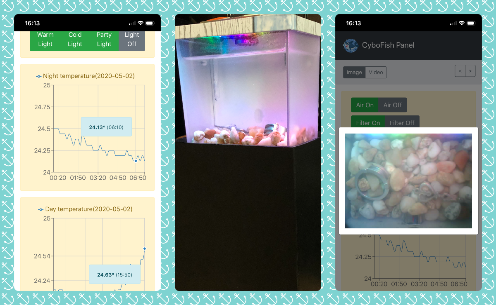
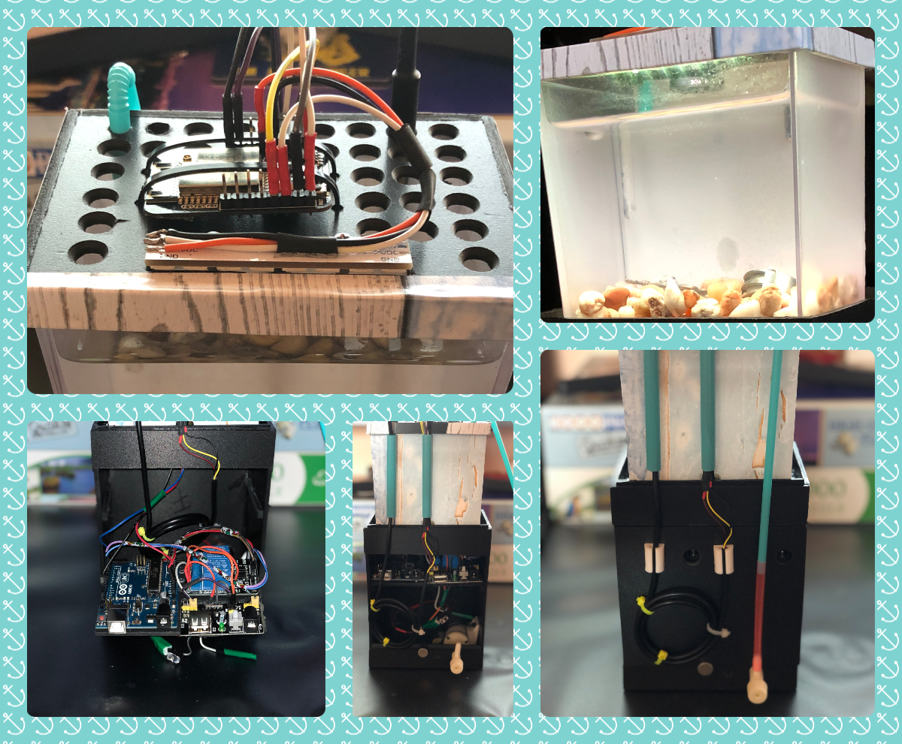

## Mini Aquarium

#### Hardware used
- Arduino Uno
- ESP32 Cam - AiThinker
- 2 Relay module
- Mini air pump(4.5V DC)
- Water resistant temperature sensor(DS18B20)
- RGB 8 LEDs bar(WS2812)
- Mini breadboard power source
- Power source 9V 1A
- Resistor 0.25W 4.7KΩ

| Software  | Hardware |
| ------------- | ------------- |
|   |   |

#### ArduPumps
Contains the source files for Arduino Uno, which is used to control the "2 Relay module" and power the Esp32Cam.

#### FishCam
Contains the source files for Esp32Cam, which:
- Controls the lights
- Controls the temperature sensor
- Controls the "2 Relay module" by sending a message via serial to Arduino Uno 

_The web server has the following routes_
- __/__ - returns current temperature and all available routes
- __/warm-on__ - turn warm lights on
- __/cold-on__ - turn cold lights on
- __/party-on__ - turn party lights on
- __/light-off__ - turn lights off
- __/air-on__ - turn air pump on
- __/air-off__ - turn air pump off
- __/filter-on__ - turn filter pump on
- __/filter-off__ - turn filter pump off
- __/image.jpg__ - returns a JPEG image
- __/stream.mjpeg__ - returns a MJPEG video stream

_Before compiling_
- Rename _UserConfig.app_(within _FishCamera/src/_) to _UserConfig.h_ and update accordingly
- Library dependencies can be found in _platformio.ini_

#### fish-admin
Contains the source files for a web application, used mainly to gather information from the temperature sensor.

_Available routes_
- __/panel__ - user interface
- __/api/settings__ - returns an array with all available routes from Esp32Cam
- __/api/cron/settings__ - saves all above settings into our local database
- __/api/temperatures/{date?}__ - returns an array with all temperatures from one day(or current day if not specified)
- __/api/cron/temperatures__ - gets the current temperature from Esp32Cam and saves it into our local database

_**Installation instructions**_
- `git clone`
- `composer install`
- create a new database
- copy *.env.example* to *.env* and update accordingly
- `php artisan migrate:install` 
-  `php artisan make:seeder SettingSeeder`
- add to your crontab  `*/10 * * * * curl http://localhost/api/cron/temperatures`

#### fish-panel
Contains the source files for a React application(based on redux/redux-saga/bootstrap4), used to control the mini aquarium.

_**Installation instructions**_
- `git clone`
- Update *constants.js* within *fish-panel/src* accordingly.
- `npm install`
- `npm run-script build`
- Copy files from */path/to/fish-panel/build/* to */path/to/laravel/public/panel* directory 

